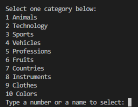
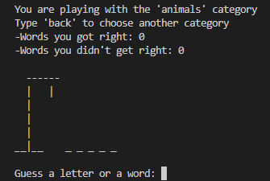
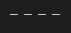
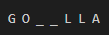
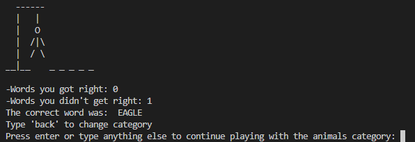
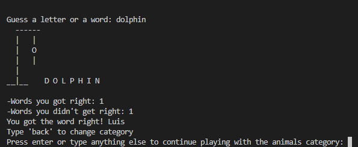
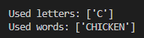

# Hangman

Hangman is a python terminal game, it is a version of a classic game in which the player has to guess a word by suggesting letters one at a time, if these are present in the word they are revealed, otherwise a part of the hangman is drawn, it is possible to try to guess the word directly, furthermore the game has 10 categories and words related to that category that are chosen randomly. This game is intended for those who want to improve their vocabulary and deduction skills.

[You can find the live version of my project here.](https://hangman2-0ebfc7274112.herokuapp.com/)

## How to play

This is a version of the classic hangman game, which you can read more about on [Wikipedia](https://www.bing.com/ck/a?!&&p=a76a61690e4a1eaeJmltdHM9MTcwNzk1NTIwMCZpZ3VpZD0yY2NiMTIyNC04OThhLTZhOTQtMWFiZC0wMTAxODhmNTZiMzcmaW5zaWQ9NTIxNA&ptn=3&ver=2&hsh=3&fclid=2ccb1224-898a-6a94-1abd-010188f56b37&psq=hangman+wikipedia&u=a1aHR0cHM6Ly9lbi53aWtpcGVkaWEub3JnL3dpa2kvSGFuZ21hbl8oZ2FtZSk&ntb=1).

The player must enter their name to start and then 10 categories will be revealed.

Depending on which category is chosen the program will pick a random word related to the category.

The program will display underscores representing the exact number of letters contained in the word.

The user will be asked to guess a letter or if the user thinks they know the word they can try to guess it directly, each failure will draw a part of the hangman until the drawing is complete or the user guesses the entire word.

It is possible to change category in the middle of the game if the user types "back" instead of the word.

At the end you can continue playing with the same category or you can change to a different one by typing the word "back".

## Features
### Existing Features
- Data stored in class instance.
- Category selection menu:
    - It has 10 different categories.
    - There are 195 words in total
    - It is possible to select the category by typing the number on the left or by typing the name in the terminal.
    - Has data validation, does not allow you to choose a number that does not exist or name
    
- The program chooses a random word from the list containing the chosen category.
- Main game loop:
    
    - The programme will tell you which category you are playing in.
    - Possibility to go back and choose another category at any time by typing the word "back" in the terminal.
    - The exact number of letters in the word is represented by underscores.
    
    - Each hit reveals a word in the right place.
    
    - Every mistake draws a part of the hanged man on the gallows.
    - The game ends when the player gets the word right or the drawing of the hangman has been completed.
    
    
    - Counter for each correct word and another counter for each missed word.
    

- Input validation:
    - You can only enter alphabetical characters in the name.
    - It is not possible to repeat letters already used, a list of letters that have been used is provided.
    
    You cannot repeat used words, a list of used words is also provided.
    - Repeating letters or words will not count as a hit or miss. 
    - You cannot enter numbers in the main game loop, entering numbers does not count as a failure.
    - You cannot enter empty strings.

### Future Features
- Allow spaces to form two words.
- Add more categories.

## Data Model

I used the Player class as a data model. The class stores the player's name, the list of letters and words used, a counter for correct words, a counter for incorrect words, and a counter for the number of attempts used to draw the hangman.

The class has two instance methods, one that adds points to any of the counters by passing the name of the counter and one that adds words or letters by passing the name of the list and the letter or word to be added.

##  Testing
- I have verified the code by running it through a PEP8 linter and no problems were found.
- Through invalid inputs, numbers not listed in the categories, category names not present, also in the main game loop passing empty numbers or strings.
- Tested on my local terminal and on the Code Institute Heroku terminal 

### Bugs
##### Solved Bugs
- I discovered a bug in the code that made it possible to add a word to the list of letters, I fixed it by making sure that only one character could be added to the list of letters.

- Fixed a bug that made it possible to add numbers to the list of letters or words by verifying that all characters were alphabetical.

### Unfixed bugs
No unfixed bugs.

### Validator Testing
- PEP8
    - No errors found when passing code through PEP8online.com

## Deployment

This project was deployed using Code Institute's mock terminal for Heroku.

- Steps for deployment
 - Fork or clone this repository
 - Create a new Heroku app
 - Set the buildbacks to "python" and "NodeJS" in that order
 - Link the Heroku app to the repository
 - Click on **Deploy**

## Credits
- Code institute for the deployment terminal.
- Code and functions created by the developer.